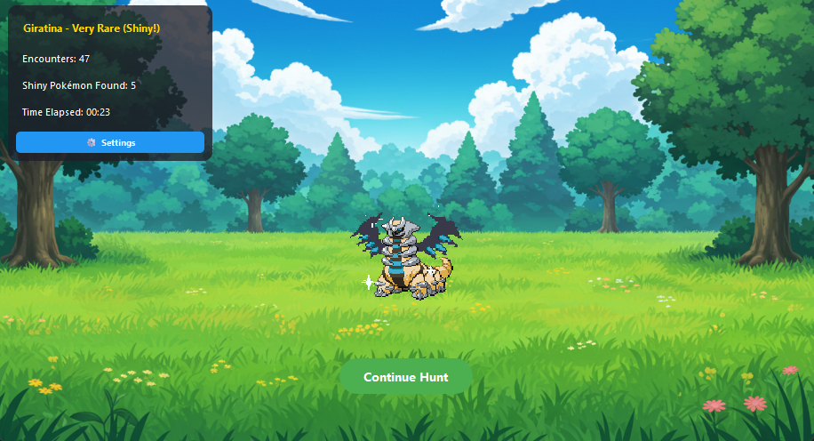

# IdleMon - Automated Shiny Hunting Simulator

Python Idle Game project that simulates encountering Pokémon with a chance of finding shiny Pokémon. Featuring animated GIFs for Pokémon encounters, shiny tracking, encounter statistics, and customization options.

> *Looking for the Linux version? Check out the [Linux branch](https://github.com/zainibeats/idlemon/tree/linux)*



## Features
- **Shiny hunting simulator** with 1/2000 encounter rate and animated GIF sprites
- **Shiny Collection window** to view, search, and sort all your caught shinies
- **Desktop Pet Mode** - optional borderless transparent window with draggable Pokémon
- **Statistics tracking** including encounter counter, timer, and total shinies found
- **Sound effects** for shiny encounters and interactions
- **Easy customization** through a built-in settings dialog

**→ See the [Features Guide](#features-guide) below for detailed information on all features**

---

## Requirements
For building from source:
- Python 3.8 or later
- Required libraries listed in requirements.txt

Install dependencies:
```bash
# Using pip (Windows/Linux)
pip install -r requirements.txt

# Or if you have multiple Python versions
python -m pip install -r requirements.txt
```

---

## Usage

### Windows Portable Version
1. Download the latest release
2. Extract the zip file anywhere you like
3. Run `IdleMon.exe` from the extracted folder

The application is fully portable:
- Can be run from any location
- All data is stored in the application folder
- No installation required
- No system modifications

### Building from Source (Windows)
1. Clone the repository
2. Install dependencies:
   ```bash
   python -m pip install -r requirements.txt
   ```
3. Build the executable:
   ```bash
   pyinstaller main.spec
   ```
4. The portable version will be created in `dist/IdleMon`

---

## Configuration

### Settings Dialog (Recommended)
The easiest way to configure IdleMon is through the built-in settings dialog:
- **Normal Mode:** Click the ⚙ Settings button in the stats panel
- **Desktop Pet Mode:** Right-click on the Pokémon and select "⚙ Settings"

Available settings:
- **Borderless Desktop Pet Mode:** Enable transparent window mode (requires restart)
- **Mute Audio:** Disable all sound effects
- **Background Image:** Choose a custom background image using the file browser

Settings are automatically saved to `config.json`.

### Manual Configuration (Advanced)
For advanced users, you can also directly edit the `config.json` file placed in the same folder as the executable:

### Example `config.json`
```json
# Using absolute path:
{
    "background_image": "C:/Users/YourName/Pictures/custom_background.png",
    "mute_audio": false
}

# OR using relative path (relative to IdleMon.exe):
{
    "background_image": "assets/images/my_background.jpg",
    "mute_audio": false
}
```

### Key Settings
- **`background_image`:** Path to background image. Can be:
  - Absolute path (e.g., "C:/Users/YourName/Pictures/custom_background.png")
  - Relative path from IdleMon.exe (e.g., "assets/images/my_background.jpg")
  - Defaults to included background if not found
- **`mute_audio`:** Set to `true` to disable all sound effects (default: `false`)

### Portable Directory Structure
```
IdleMon/
├── IdleMon.exe
├── assets/
│   ├── gifs/
│   │   ├── gen1/
│   │   │   ├── normal/
│   │   │   └── shiny/
│   │   ├── gen2/
│   │   │   ├── normal/
│   │   │   └── shiny/
│   │   ├── gen3/
│   │   │   ├── normal/
│   │   │   └── shiny/
│   │   ├── gen4/
│   │   │   ├── normal/
│   │   │   └── shiny/
│   │   └── gen5/
│   │       ├── normal/
│   │       └── shiny/
│   ├── sounds/
│   │   ├── shiny_sound1.wav
│   │   └── continue_sound1.wav
│   ├── data/
│   │   ├── gen1_pokemon_names.txt
│   │   ├── gen2_pokemon_names.txt
│   │   ├── gen3_pokemon_names.txt
│   │   ├── gen4_pokemon_names.txt
│   │   └── gen5_pokemon_names.txt
│   └── images/
│       └── background.png
├── config.json (can be edited via Settings dialog)
└── logs/      (created automatically)
    ├── shiny_count.bin         (total shiny count)
    ├── shinies_encountered.txt (shiny collection data)
    └── error.log
```

---

## Features Guide

### Shiny Collection
Track and view all your shiny Pokémon in a dedicated collection window:

**Opening the Collection:**
- Click on the "Shiny Pokémon Found: X" counter in normal mode
- Right-click on the Pokémon (in either mode) and select "View Collection"

**Collection Features:**
- **Grid Display:** View all your shinies in a 4-column grid
- **Hover Animations:** GIFs animate when you hover over them
- **Search:** Filter Pokémon by name using the search bar
- **Sort Options:**
  - By Name (alphabetical)
  - By Rarity (Very Rare → Very Common)
  - By Count (most duplicates first)
- **Statistics:** See total shinies caught and unique species count
- **Duplicate Tracking:** Badges show "x2", "x3", etc. for multiple catches of the same Pokémon

### Desktop Pet Mode
Enable borderless mode for a transparent desktop companion:

**How to Enable:**
1. Open Settings (⚙ button or right-click menu)
2. Enable "Borderless Desktop Pet Mode"
3. Restart the application

**Features:**
- Transparent, frameless window showing only the Pokémon
- Drag the Pokémon anywhere on your screen
- Right-click for context menu:
  - View Collection
  - Settings
  - Continue Hunt (after finding a shiny)
  - Exit IdleMon
- System tray icon for easy exit

### Encounter System
- Each encounter has a chance of being shiny (1/2000 by default)
- When a shiny is found:
  1. The encounter animation changes
  2. A sound plays (if not muted)
  3. The encounter count remains displayed
  4. A continue button appears
- After pressing continue:
  1. The encounter counter resets to 0
  2. A new hunting session begins

### Sound System
- Shiny encounters trigger a special sound effect
- Continue button plays a confirmation sound
- Optional muting through settings menu or config.json

### Statistics Tracking
- Real-time encounter counter (resets after continuing from a shiny)
- Elapsed time tracker
- Total shiny Pokémon found (clickable to view collection)
- Automatic data saving for shiny counts and collection data
- Persistent collection history with rarity and duplicate tracking

### Resetting Progress
To reset your hunting progress, you can either:

Delete individual files:
1. Navigate to the `logs` directory in your IdleMon folder
2. Delete these files:
   - `shiny_count.bin` (resets total shinies to 0)
   - `shinies_encountered.txt` (clears shiny encounter history)

OR

Simply delete the entire `logs` directory.
New files will be automatically created when you next run the program.

---

## Troubleshooting
- **Missing GIFs:** Ensure GIF files exist in the correct generation's normal/shiny directories
- **Animation Issues:** Verify GIF files are properly formatted
- **Sound Problems:**
  - Check that sound files exist in the assets/sounds directory
  - Verify audio is not muted in Settings
- **Background Image:**
  - Use the Settings dialog to browse for valid image files
  - Ensure the specified path exists and is accessible
- **Shiny Collection Not Loading:**
  - Check that `logs/shinies_encountered.txt` exists and is not corrupted
  - File format should be: `pokemon_name | rarity | count`
- **Application Not starting:**
  - First, make sure you are running the EXE from the [project root](#portable-directory-structure)
  - Close any instances of Idlemon in Task Manager
  - If all else fails, delete the `logs` directory in your IdleMon folder. This _WILL_ reset all data!!
- **Desktop Pet Mode Issues:**
  - Requires restart to enable/disable
  - May not work on all systems (requires system tray support)
  - Use right-click context menu to access features
  - Ensure the `config.json` file is correctly formatted (or use Settings dialog instead)

---

## License
This project is licensed under the MIT License.
